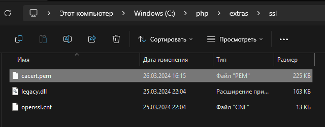
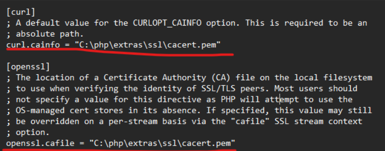

# Как запустить Laravel сервер?
1. Установить php версии 8.2 и выше
2. Установить composer последней версии
3. В папке с установленным php нужно переименовать файл php-development.ini в php.ini
4. Установить SSL сертификат в папку установленную папку php/extras/ssl


5. и указать пути к этому ssl сертификату в php.ini

6. далее запустить в папке с laravel (gasudev-backend) команду ```composer install``` (тут могут быть ошибки из-за отключенных extensions в php.ini. Ошибки укажут какой extension нужно раскомментировать)
7. далее ```php artisan key:generate```
8. далее ```php artisan serve```

Сервер должен запуститься на http://localhost:8000 (если этого не произошло или порт отличается возможно порт уже занят)

Если после всех выполненных действий всё равно падают ошибки можно написать @egorlaptevv в тг может он что-то знает

# Как запустить React
1.Перейдите в паку gasudev-frontend в корне проек
1. npm i
2. npm start